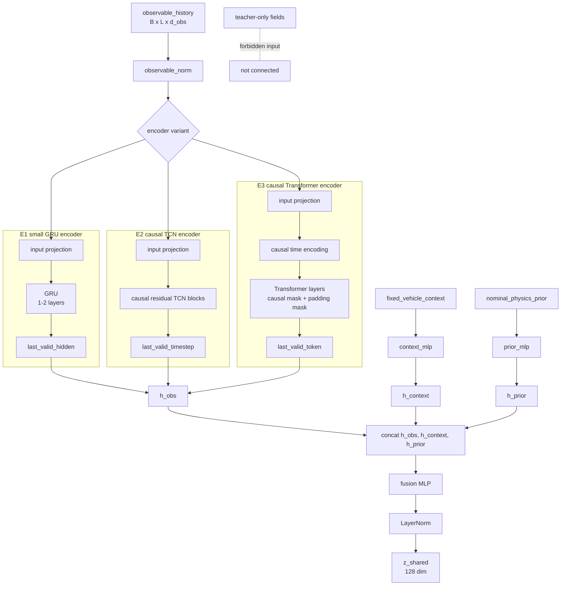
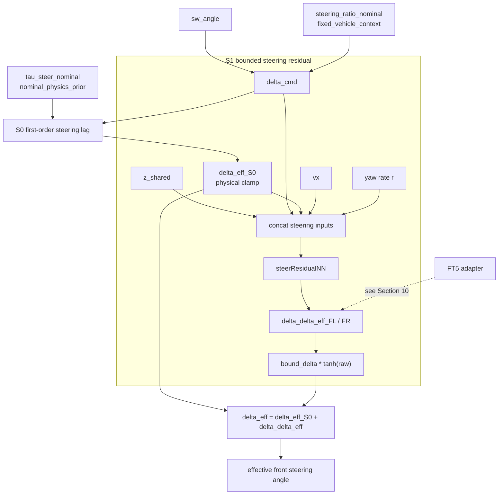
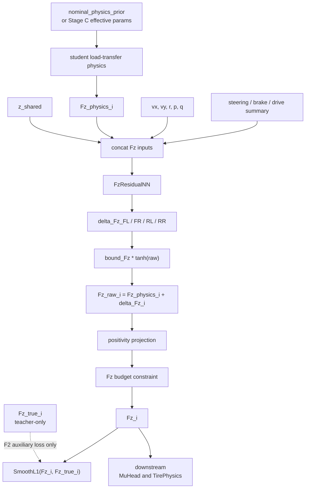
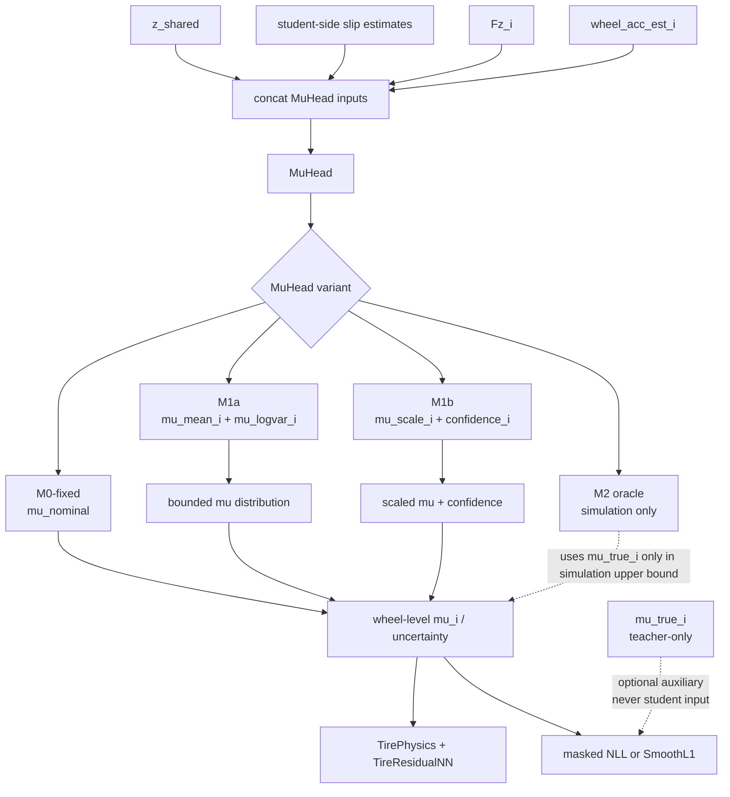
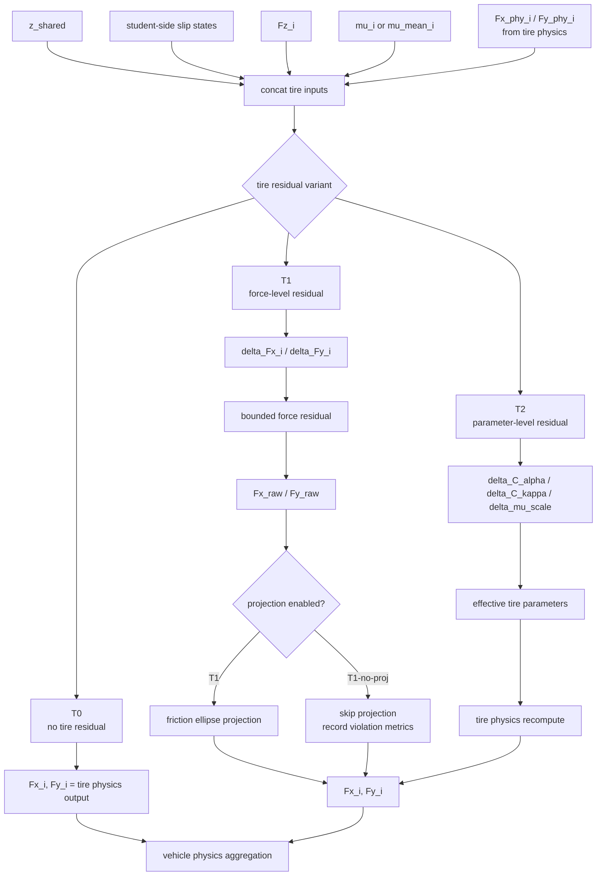
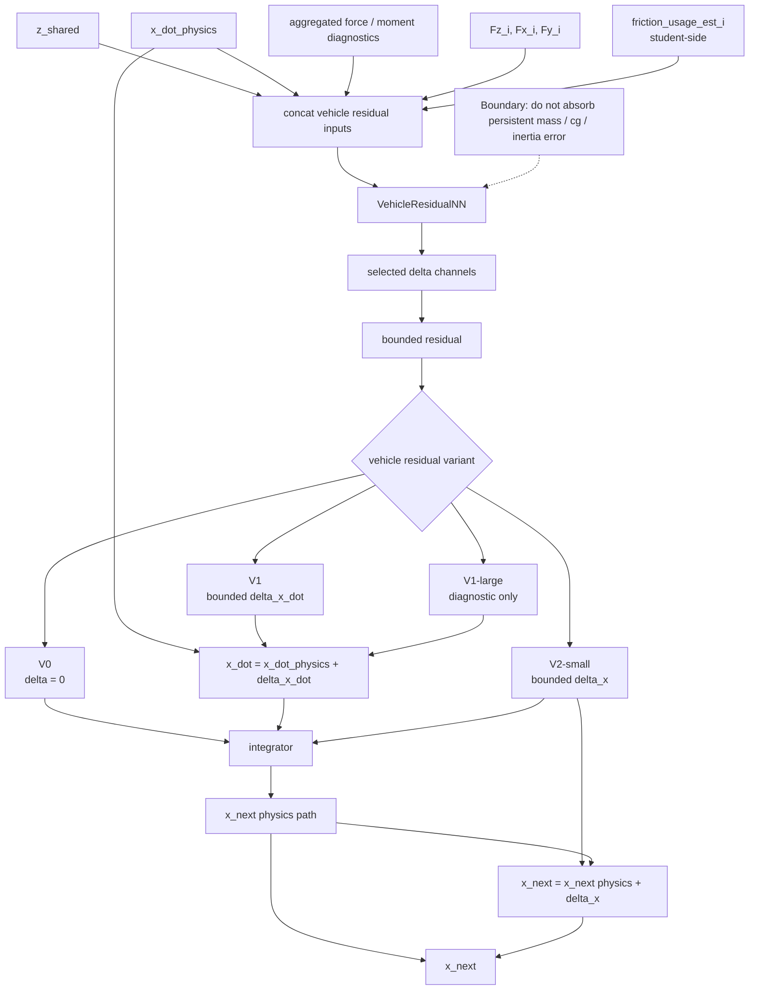
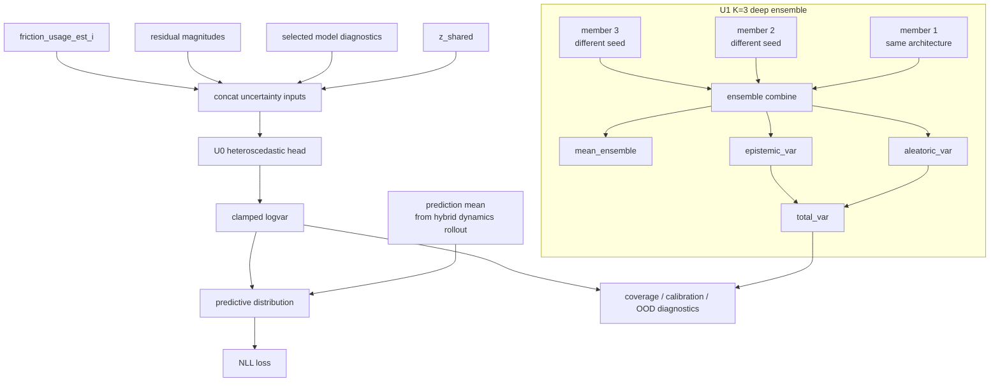
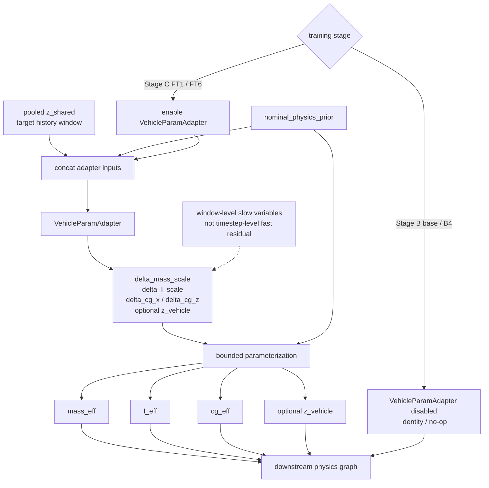
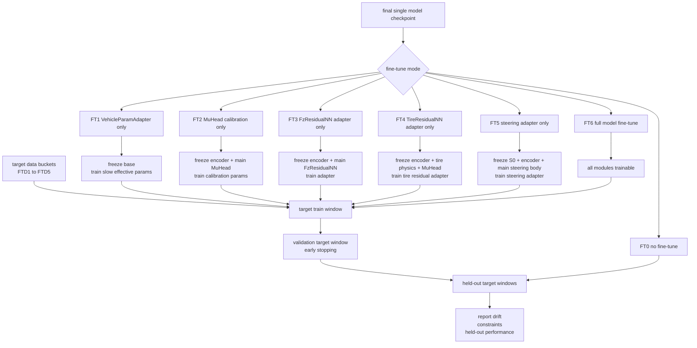
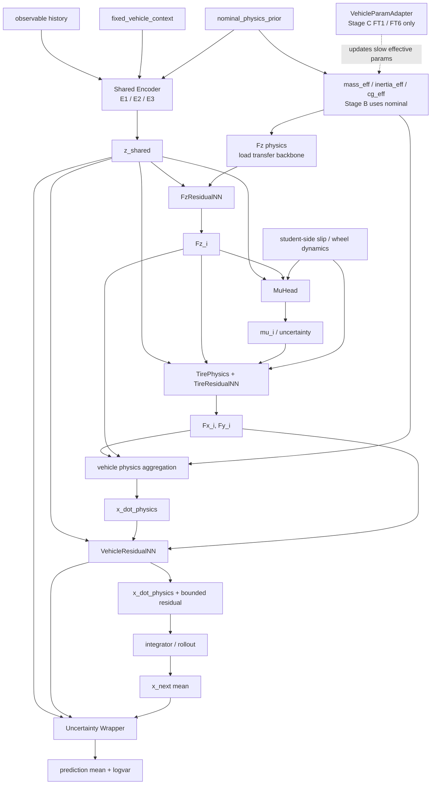

# MODULE_DESIGN

**日期**：2026-05-20  
**状态**：current v4
**作用**：定义 student model 和各组件的详细设计方案。

## 0. 文档边界与阅读方式

本文档是 student model 组件结构的权威来源，覆盖模块职责、输入输出、插入位置、bounded 参数化、约束、diagnostics、fine-tune adapter 粒度和实现注意事项。

文档边界：

```text
EXPERIMENT_PLAN.md:
  实验设计、实验块、成功标准、对照组、执行顺序。

DATA_DESIGN.md:
  数据字段、可观测字段、teacher-only 字段、工况组合、数据比例。

TEACHER_SIMULATOR_DESIGN.md:
  高自由度 teacher simulator 的物理建模细节。

MODULE_DESIGN.md:
  student model 的组件结构和模块接口。
```

阅读规则：

```text
每个组件的流程图是该组件结构的唯一权威描述。
文字部分只保留职责、接口、参数化、约束和诊断，不重复展开流程图中的网络路径。
FT1-FT6 的冻结/训练规则统一放在第 10 节，组件章节只标注相关 FT 编号。
实验配置编号 E/T/F/S/M/V/U/FT 与 EXPERIMENT_PLAN.md 保持一致。
```

## 1. 总体原则

第一版 student model 以可微分物理 backbone 为主，神经网络模块只做受控补偿。

默认约束：

```text
所有 residual / head 输出使用 bounded parameterization
越靠后的 residual 容量越小
所有 teacher-only 字段只用于 loss / diagnostics / plotting
所有 model input 必须来自 observable、fixed_vehicle_context、nominal_physics_prior 或 student-side computed diagnostics
所有 Stage B ablation 配置从头训练
所有 Stage C fine-tune 从同一个 final single model checkpoint 初始化
```

默认时间设置：

```text
history_len: 0.5-2.0 s
rollout_train_horizon: 1-5 s warm-up, then extend to 10 s
dt: follow dataset sampling rate, resample only in data pipeline
```

### 1.1 Neural Head Complexity Policy

第一版所有 residual / head 默认使用 lightweight MLP。这里的 MLP 是 first implementation baseline，不是结构上限。

这样设计的原因：

```text
Shared Encoder 负责历史信息、时序记忆和跨传感器融合。
各 residual / head 只负责基于 z_shared 和当前 student-side diagnostics 做局部 bounded correction。
组件职责清楚，ablation 更容易解释。
fine-tune 参数量更小，小数据目标车适配更稳。
```

默认 head 复杂度：

| 模块 | 默认结构 | 升级候选 | 不建议第一版默认使用 |
|---|---|---|---|
| `steerResidualNN` | small bounded MLP | actuator-conditioned MLP、局部 steering GRU | 大 Transformer steering head |
| `FzResidualNN` | bounded MLP | residual MLP、suspension-conditioned head | 直接预测任意 Fz 且无 budget 约束 |
| `MuHead` | bounded / calibrated MLP | confidence calibration、latent smoother | 在 small-slip 区强行输出过确信 μ |
| `TireResidualNN` | shared bounded MLP | wheel embedding、FiLM、slip-regime MoE、局部 GRU | 取消 friction constraint 的大黑盒 force model |
| `VehicleResidualNN` | very small bounded MLP | `V1-large` diagnostic only | 大容量时序网络替代整车物理模型 |
| `Uncertainty Wrapper` | heteroscedastic MLP | `K=3` ensemble | 让 uncertainty head 改变 dynamics mean |
| `VehicleParamAdapter` | slow adapter MLP | window-level latent adapter | timestep-level fast parameter generator |

升级触发条件：

```text
rollout 明显 underfit，且 residual 没有长期贴边 saturate
低 μ、Split-μ、transition μ 或极限操控场景有稳定失败模式
增加 encoder 容量 E2/E3 后仍不能解释目标误差
诊断显示误差集中在某个物理子模块，而不是全局漂移
```

优先升级顺序：

```text
1. E1 small GRU encoder + MLP heads
2. E2 causal TCN encoder + MLP heads
3. E3 causal Transformer encoder + MLP heads
4. 只给 TireResidualNN 或 steerResidualNN 增加局部动态结构
5. 保持 VehicleResidualNN 小容量，防止黑盒接管物理模型
```

## 2. Shared Encoder

实验引用：`E1/E2/E3`。Base 默认：`E1 + T1 + F1 + S1 + M1a + V1 + U0`。

Shared Encoder 的职责是把 student-visible 输入融合成统一 latent `z_shared`，供 Steering、FzResidualNN、MuHead、TireResidualNN、VehicleResidualNN 和 Uncertainty Wrapper 复用。

### 2.1 Interface

| 输入 / 输出 | 形状或来源 | 作用 |
|---|---|---|
| `observable_history` | `[B, L, d_obs]` | 最近 `L` 个时间步的可观测时序信号 |
| `observable_norm` | normalization layer | 只归一化 `observable_history` |
| `fixed_vehicle_context` | vehicle metadata | 固定几何/layout 信息，经 `context_mlp` 编成 `h_context` |
| `nominal_physics_prior` | nominal prior metadata | `mass_nominal / Ix_nominal / Iy_nominal / Iz_nominal / cg_x_nominal / cg_z_nominal / tau_steer_nominal`，经 `prior_mlp` 编成 `h_prior` |
| `z_shared` | `128-dim` | 融合后的共享 latent |

`observable_history` 只包含 student 可见的时序观测。`fixed_vehicle_context` 是不会随时间变化的尺寸/layout 参数。`nominal_physics_prior` 是可变物理量的名义先验，不等于真实值；目标车/目标时间段的慢变量修正只在 Stage C 通过 `VehicleParamAdapter` 启用。

### 2.2 Encoder Variants

| 配置 | 名称 | 第一版角色 | 主要取舍 |
|---|---|---|---|
| `E1` | small GRU encoder | base 默认 | 结构小，支持变长 history，在线递推和 fine-tune 简单 |
| `E2` | causal TCN encoder | 必做 ablation | 训练并行、固定感受野清楚；对 history length / sampling rate 更敏感 |
| `E3` | causal Transformer encoder | 必做 ablation，不默认部署 | 可关注关键激励片段；容量、延迟、过拟合风险更高 |

### 2.3 Structure Flow



### 2.4 Settings And Diagnostics

| 配置 | 默认设置 | 实现要求 | 诊断重点 |
|---|---|---|---|
| `E1` | `hidden_dim=128`; `layers=1` first, `2` only if underfit; `dropout=0.0-0.1` | variable-length history 用 `valid_mask` 取 `last_valid_hidden` | long rollout stability; target-window fine-tune stability; hidden drift |
| `E2` | `channels=128`; `kernel_size=3`; `dilations=[1,2,4,8]`; `dropout=0.05` | causal padding 或显式裁剪；感受野覆盖主要 `history_len` | μ transition delay; Split-μ yaw / wheel-speed prediction; fixed-window sensitivity |
| `E3` | `d_model=128`; `num_layers=2` first; `num_heads=4`; `ffn_dim=256`; `dropout=0.05-0.1` | 必须同时使用 causal mask 和 padding mask；禁止 bidirectional encoder | held-out vehicle/config 泛化；过拟合；attention 是否集中在有效激励片段 |

通用约束：

```text
encoder 不接收 teacher-only 字段
encoder 必须 causal，不允许使用未来帧
E1/E2/E3 使用相同 observable 字段、相同 z_shared 维度和相同 downstream modules
encoder 在 FT1-FT5 默认冻结，FT6 才允许整体 fine-tune
```

## 3. Steering Module

实验引用：`S0/S1`，fine-tune 引用：`FT5`。

Steering Module 把 steering wheel command 转成前轮等效转角，并允许一个小的 bounded residual 覆盖真实转向系统中的 delay、柔度、间隙、滞回和饱和误差。

### 3.1 Interface And Parameterization

| 配置 | 含义 | 输出 |
|---|---|---|
| `S0` | 一阶 steering lag physics | `delta_eff_S0` |
| `S1` | `S0 + steerResidualNN` | `delta_eff` |

核心物理形式：

```text
delta_cmd = sw_angle / steering_ratio_nominal
dot(delta_eff) = (delta_cmd - delta_eff) / tau_steer
tau_steer = tau_steer_nominal from nominal_physics_prior
delta_eff clamp: physical steering limit
```

`tau_steer_nominal` 是 student-visible nominal prior，不是真实执行器时间常数。

Residual 参数化：

```text
Δdelta_eff = bound_delta * tanh(raw)
bound_delta: 1-3 deg in radians
regularization: Δdelta magnitude + temporal smoothness
```

S1 residual 的输入有两个实现变体：

```text
S1-min:
  z_shared + delta_cmd + delta_eff_S0

S1-skip:
  z_shared + delta_cmd + delta_eff_S0 + current_state_skip
  current_state_skip = vx, yaw rate r
```

`vx/r` 是 student-visible direct skip input，不是 teacher leakage。它们理论上也包含在 `z_shared` 中，但 direct skip 保留当前帧精确状态，降低 small steering residual head 的学习难度。Base 默认使用 `S1-skip`；若 steering residual 出现过拟合或贡献不稳定，再用 `S1-min` 做实现级对照。`S1-min/S1-skip` 不新增顶层实验编号，仍归入 `S1`。

### 3.2 Structure Flow



### 3.3 Constraints And Diagnostics

```text
S1 residual 不改变 steering_ratio_nominal
S1 residual 不直接输出无限制 absolute steering angle
FT5 只训练 steering residual adapter，规则见第 10 节
```

诊断重点：

```text
steering delay response
large steer saturation
left/right residual symmetry
Δdelta_eff magnitude and smoothness
```

## 4. FzResidualNN

实验引用：`F0/F1/F2`，fine-tune 引用：`FT3`。

`FzResidualNN` 在 student load-transfer physics 之后补偿垂向载荷估计误差。它不替代载荷转移物理模型，只输出受限 `ΔFz_i`。

### 4.1 Interface And Parameterization

| 配置 | 含义 | 训练信号 |
|---|---|---|
| `F0` | only load-transfer physics | rollout / constraints |
| `F1` | physics + bounded `FzResidualNN` | rollout / constraints |
| `F2` | `F1 + teacher Fz auxiliary loss` | simulation-only auxiliary |

输入来自：

```text
z_shared
Fz_physics_i
vx, vy, r, p, q
steering / brake / drive summary
```

参数化：

```text
ΔFz_i = bound_Fz_i * tanh(raw_i)
bound_Fz_i: 0.05-0.10 * mass_eff * g per wheel
Fz_raw_i = Fz_physics_i + ΔFz_i
Fz_i = softplus(Fz_raw_i) or clamp_min(Fz_raw_i, eps)
```

载荷预算约束：

```text
L_sumFz_static = |ΣFz_i - m_eff * g| only for flat quasi-static sanity cases
L_Fz_budget = |ΣFz_i - Fz_budget_physics| for dynamic training
```

`Fz_budget_physics` 必须来自 student-side physics，可包含 grade / bank projection、aero vertical force、body vertical acceleration proxy、rough-road contact event mask 等可观测或模型内部可计算项。

### 4.2 Structure Flow



### 4.3 Constraints And Diagnostics

```text
base F1 不得使用 teacher-only Fz_true_i 作为输入或约束目标
F2 只在仿真训练/诊断中使用 L_Fz_teacher
FT3 规则见第 10 节
```

诊断重点：

```text
ΣFz budget error
Fz positivity violation
left/right and front/rear load transfer phase
ΔFz residual saturation
F2 auxiliary 是否改善 rollout，而不是只改善 Fz supervised metric
```

## 5. MuHead

实验引用：`M0-fixed/M1a/M1b/M2-oracle`，fine-tune 引用：`FT2`。

`MuHead` 估计轮端可用摩擦水平或其缩放/置信度。真实部署时没有 `μ_true_i`，因此 `MuHead` 必须通过 rollout、轮胎一致性、friction ellipse consistency 和 calibration diagnostics 学习。

### 5.1 Variants And Outputs

| 配置 | 输出 | 用途 |
|---|---|---|
| `M0-fixed` | fixed `μ_nominal` | physics-only / no road latent baseline |
| `M1a` | `μ_mean_i`, `μ_logvar_i` | base 默认，表达 μ 不确定性 |
| `M1b` | `μ_scale_i`, `confidence_i` | calibration / scaling 对照 |
| `M2-oracle` | `μ_i = μ_true_i` | simulation upper bound only |

输入来自：

```text
z_shared
slip_ratio_est_i / slip_angle_est_i
Fz_i
wheel_acc_est_i
```

参数化：

```text
M1a:
  μ_mean_i = μ_min + (μ_max - μ_min) * sigmoid(raw_mu)
  μ_logvar_i = clamp(raw_logvar, logvar_min, logvar_max)

M1b:
  μ_i = μ_nominal * exp(clip(Δμ_scale_i))
  confidence_i = sigmoid(raw_confidence)

default range:
  μ_min = 0.05
  μ_max = 1.3-1.5
```

### 5.2 Structure Flow



### 5.3 Constraints And Diagnostics

```text
small-slip 区下调 absolute μ supervision 权重
confidence / logvar 必须反映弱可观测性，不能强行过确信
M2-oracle 禁止作为可部署模型或 student input
FT2 规则见第 10 节
```

诊断重点：

```text
held-out road μ episodes
transition μ response delay
low-excitation uncertainty calibration
friction usage consistency
μ estimate 是否被 TireResidualNN 完全绕过
```

## 6. TireResidualNN

实验引用：`T0/T1/T1-no-proj/T2`，fine-tune 引用：`FT4`。

`TireResidualNN` 补偿轮胎物理模型误差。Base 使用 `T1` force-level residual，并把最终轮胎力投影回 friction ellipse。

### 6.1 Variants And Parameterization

| 配置 | 输出 | 角色 |
|---|---|---|
| `T0` | no residual | tire physics baseline |
| `T1` | `ΔFx_i / ΔFy_i` | base 默认 |
| `T1-no-proj` | `ΔFx_i / ΔFy_i` without projection | projection 必要性对照 |
| `T2` | `ΔC_alpha_i / ΔC_kappa_i / Δμ_scale_i` | parameter-level residual 对照 |

输入来自：

```text
z_shared
slip_ratio_est_i / slip_angle_est_i
Fz_i
μ_i or μ_mean_i
Fx_phy_i / Fy_phy_i
```

`T1` 参数化：

```text
ΔFx_i, ΔFy_i = bound_force_i * tanh(raw_i)
bound_force_i: 0.05-0.10 * μ_i * Fz_i

[Fx_i, Fy_i] = project_to_friction_ellipse(
  Fx_phy_i + ΔFx_i,
  Fy_phy_i + ΔFy_i,
  μ_i,
  Fz_i
)
```

`T2` 参数化：

```text
C_alpha_eff = C_alpha_nominal * exp(clip(ΔC_alpha))
C_kappa_eff = C_kappa_nominal * exp(clip(ΔC_kappa))
μ_eff = μ_i * exp(clip(Δμ_scale))
```

### 6.2 Structure Flow



### 6.3 Constraints And Diagnostics

```text
T1 默认启用 friction ellipse projection
T1-no-proj 只用于证明 projection 的必要性
T2 更可解释但可能在 large slip / low-μ 中弱于 T1
FT4 规则见第 10 节
```

诊断重点：

```text
friction ellipse violation rate
longitudinal/lateral coupling error
large slip and combined slip prediction
low-μ and Split-μ force consistency
TireResidualNN 是否绕过 MuHead
```

## 7. VehicleResidualNN

实验引用：`V0/V1/V1-large/V2-small`，fine-tune 引用：`FT6`。

`VehicleResidualNN` 位于车辆物理聚合之后，补偿剩余整车级误差。它是最后一道小容量 residual，不能替代 mass/cg/inertia 等慢变量适配。

### 7.1 Variants And Output Channels

| 配置 | 输出位置 | 角色 |
|---|---|---|
| `V0` | no residual | physics + tire residual baseline |
| `V1` | bounded `Δx_dot` before integration | base 默认 |
| `V1-large` | larger `Δx_dot` head | diagnostic only |
| `V2-small` | bounded `Δx` after integration | 与 `Δx_dot` 位置对照 |

输入来自：

```text
z_shared
x_dot_physics
aggregated force/moment diagnostics
Fz_i, Fx_i, Fy_i
friction_usage_est_i
```

`friction_usage_est_i` 必须由 student 当前计算图中的 `Fx_i/Fy_i/Fz_i/μ_i` 计算：

```text
friction_usage_est_i =
  sqrt(Fx_i^2 + Fy_i^2) / max(μ_i * Fz_i, eps)
```

建议第一版输出通道：

```text
Δvx_dot
Δvy_dot
Δr_dot
optional Δp_dot / Δq_dot
```

不建议第一版直接输出：

```text
absolute yaw
absolute roll
absolute pitch
wheel speed state overwrite
```

### 7.2 Structure Flow



### 7.3 Constraints And Diagnostics

```text
teacher-only friction_usage_i 只能用于 diagnostics、auxiliary loss 或 plotting
VehicleResidualNN 不应长期承担 mass/cg/inertia 等慢变量误差
VehicleResidualNN residual magnitude 应随 FT1 adapter 生效而下降
FT6 同时开放 VehicleParamAdapter 和 full model，用作上界并监控抢解释权
```

诊断重点：

```text
Δx_dot residual magnitude and saturation
residual frequency content
rollout stability
FT1 后 VehicleResidualNN magnitude 是否下降
V1 与 V2 的误差传播差异
```

## 8. Uncertainty Wrapper

实验引用：`U0/U1`。

Uncertainty Wrapper 不改变 hybrid dynamics 的均值路径，只输出预测分布的不确定性。

### 8.1 Variants And Outputs

| 配置 | 结构 | 角色 |
|---|---|---|
| `U0` | single-model heteroscedastic head | base 默认 |
| `U1` | `K=3` deep ensemble | uncertainty 对照，不默认部署 |

`U0` 输入来自：

```text
z_shared
selected model diagnostics
residual magnitudes
friction_usage_est_i
```

`U0` 输出：

```text
prediction mean: from hybrid dynamics rollout
prediction logvar: clamped logvar for supervised state channels or state increments
```

NLL loss：

```text
L_nll = 0.5 * exp(-logvar) * (target - mean)^2 + 0.5 * logvar
L_unc_calib = optional calibration / coverage penalty
```

`U1` 合成：

```text
member_mean_k = prediction mean from ensemble member k
mean_ensemble = mean_k(member_mean_k)
aleatoric_var = mean_k(exp(logvar_k))
epistemic_var = var_k(member_mean_k)
total_var = aleatoric_var + epistemic_var
```

### 8.2 Structure Flow



### 8.3 Constraints And Diagnostics

```text
U0 不接收 teacher-only 字段
U0 不改变 physics force / state mean
U1 必须训练 K=3 independent copies，记录 seed、split 和 checkpoint
如果 U1 只改善 RMSE 而不改善 calibration / coverage / OOD detection，不作为 uncertainty 贡献
```

## 9. VehicleParamAdapter

实验引用：`FT1/FT6`。

`VehicleParamAdapter` 是 Stage C 目标车/目标时间段 slow adapter。它不属于 Stage B base model，也不参与 B4 组件级 ablation。

### 9.1 Role And Interface

Stage B 多车多工况训练时，student physics 直接使用 `nominal_physics_prior` 中的 `mass_nominal / inertia_nominal / cg_nominal / tau_steer_nominal`，不启用 adapter。这样可以让 base 表示通用动力学能力，避免 adapter 在多车训练中按 episode 吸收车辆差异，削弱组件 ablation 的可解释性。

Stage C 中：

```text
FT1:
  freeze base model
  enable VehicleParamAdapter
  train only VehicleParamAdapter

FT6:
  enable VehicleParamAdapter
  full model fine-tune as upper bound
```

初始化为 identity / no-op：

```text
Δmass_scale = 0
ΔI_scale = 0
Δcg_x = 0
Δcg_z = 0
optional z_vehicle = 0
```

输出参数：

```text
mass_eff = mass_nominal * exp(clip(Δmass_scale, -b_m, b_m))
I_eff = I_nominal * exp(clip(ΔI_scale, -b_I, b_I))
cg_eff = cg_nominal + b_cg * tanh(raw_cg)

initial bounds:
  b_m = log(1.3)
  b_I = log(1.5)
  b_cg_x = 0.2-0.5 m
  b_cg_z = 0.1-0.3 m
```

### 9.2 Structure Flow



### 9.3 Constraints And Diagnostics

```text
pooled z_shared = mean/attention pooling over history window, not per-step instantaneous latent
mass_eff / inertia_eff / cg_eff 在一个 rollout window 内保持常值
跨 window 更新时使用 low-pass smoothing 或 temporal smoothness penalty
禁止让 VehicleParamAdapter 按 timestep 输出快速变化量
```

与 `VehicleResidualNN` 的边界：

```text
VehicleParamAdapter:
  episode/window-level slow variables
  modifies mass_eff / inertia_eff / cg_eff / optional z_vehicle
  explains persistent target-vehicle/time-window shifts

VehicleResidualNN:
  timestep-level small fast residual
  modifies selected x_dot channels after physics aggregation
  explains remaining high-frequency or unmodeled dynamics
```

实现判据：如果 FT1 已经使 `VehicleResidualNN` magnitude 明显下降，说明 slow adapter 捕获了主要目标车差异；如果 FT1 无效但 V1/FT6 有效，说明当前 adapter 输出空间不足。

## 10. Fine-Tune Adapter Granularity

FT0-FT6 都从同一个 final single model checkpoint 出发。除指定模块外，shared encoder、physics backbone 和其他 residual modules 默认冻结。

| 配置 | 训练内容 | 冻结内容 | 目的 |
|---|---|---|---|
| `FT0` | 无 | 全部 | no fine-tune baseline |
| `FT1` | `VehicleParamAdapter` | base model | 目标车/目标时间段慢变量适配 |
| `FT2` | `MuHead` calibration adapter | encoder、main MuHead、TireResidualNN、VehicleResidualNN | 路面/摩擦 calibration |
| `FT3` | `FzResidualNN` output affine/bias 或 bottleneck adapter | encoder、main FzResidualNN | 载荷转移残差适配 |
| `FT4` | `TireResidualNN` output affine/bias 或 bottleneck adapter | encoder、tire physics、MuHead、main TireResidualNN | 轮胎残差适配 |
| `FT5` | `steerResidualNN / SteeringHead` adapter | S0、encoder、main steering body | 转向执行器误差适配 |
| `FT6` | full model + `VehicleParamAdapter` | 无或只冻结不可训练物理常量 | 上界和过拟合风险参考 |

所有 FT1-FT5 必须记录：

```text
adapter parameter drift
residual magnitude drift
held-out target window performance
physical constraint changes
small-data overfitting signs
```

### 10.1 Fine-Tune Flow



## 11. Module Dependency Graph

第一版假设模块依赖是单向的。若实现中引入 Fz/Mu/Tire 的双向依赖，需要增加交互消融，不能只依赖单向执行顺序。



关键假设：

```text
FzResidualNN 不直接依赖 MuHead 输出
MuHead 可以依赖 Fz_i、student-side slip estimates、wheel dynamics 和 observable history
TireResidualNN 可以依赖 MuHead 输出的 μ_i / uncertainty
VehicleResidualNN 只看聚合后的 student-side physics diagnostics，不向前反馈
UncertaintyWrapper 只包裹最终预测分布，不改变 dynamics mean
```

## 12. Training Schedule

训练协议、loss 组成、ablation 从头训练规则和 fine-tune checkpoint 规则以 `EXPERIMENT_PLAN.md` 第 9 章为准。本节只说明模块启用顺序和实现时的初始 loss 权重量级。

推荐顺序：

```text
Stage 0:
  physics-only sanity
  no neural residual

Stage 1:
  FzResidualNN warm-up
  short rollout horizon

Stage 2:
  enable MuHead + TireResidualNN
  include low-μ / Split-μ / transition data

Stage 3:
  enable small VehicleResidualNN
  add residual magnitude penalty

Stage 4:
  enable U0 heteroscedastic uncertainty after deterministic rollout is stable
  low-LR end-to-end training
  increase rollout horizon

Stage 5:
  target fine-tune
  enable VehicleParamAdapter only for FT1 and FT6
  FT0-FT6 × FTD data buckets
```

默认 loss 权重先从以下量级搜索：

```text
λ_one_step: 0.1-1.0
λ_constraint: 0.1-10.0
λ_residual: 1e-4-1e-2
λ_smooth: 1e-4-1e-2
λ_teacher: 0.1-1.0 for simulation-only auxiliary losses
```

## 13. Ablation Implementation Notes

本节是 `EXPERIMENT_PLAN.md` 中 ablation 训练协议的实现清单。若两者冲突，以 `EXPERIMENT_PLAN.md` 为准。

每个 ablation 配置必须明确记录：

```text
config name
enabled modules
trainable modules
random seed
train/val/test split id
rollout horizon
optimizer / learning rate
best checkpoint selection metric
```

Stage B component ablation：

```text
all configs train from scratch
same train/val/test split
same training budget
same early stopping rule
only one component setting changes relative to base when testing component ablation
VehicleParamAdapter disabled in all Stage B component ablations
```

Stage C fine-tune：

```text
same final single model checkpoint
same target train pools
same target test windows
FT1-FT5 only open specified module
FT6 opens full model
FTD data subsets nested when possible
```

## 14. Open Design Decisions

仍需在实现前确认：

```text
final encoder choice after E1/E2/E3 ablation
which x_dot channels VehicleResidualNN may modify
exact friction ellipse projection differentiable form
whether M1a or M1b is default after first MuHead ablation
bound_scale fixed or weakly learnable
teacher simulator dt and student integration method
whether TireResidualNN or steerResidualNN needs local dynamic structure after E1/E2/E3 comparison
```
